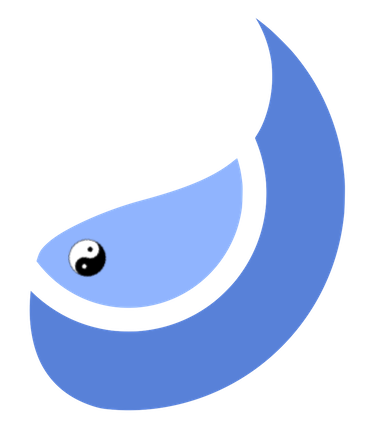

## yang 

.. of Clojure's yin

[](https://github.com/tolitius/yang/releases)
[](https://clojars.org/tolitius/yang)

- [why](#why)
- [license](#license)

## why

.. not to carry often useful functions from project to project

some of these have a faint "missing from Clojure" feeling<br/>
some just very useful but have no such feeling

one thing they all have in common: **no external dependencies**

## show me

ok. here are a few examples, there are many more inside:

lang:

```clojure
=> (require '[yang.lang :as l])

=> (l/fmk {"a" 42 "b" 34} keyword)
{:a 42, :b 34}

=> (l/fmv {"a" 42 "b" 34} inc)
{"a" 43, "b" 35}

=> (l/dash-keys {:a_foo 42 :b_bar 34})
{:a-foo 42, :b-bar 34}

=> (l/and-> 5 number? pos?)
true
=> (l/and-> nil number? pos?)
false

=> (l/group-by-ns {:a/one :a-one :b/one :b-one :a/two :a-two :b/two :b-two})
{:a {:one :a-one, :two :a-two},
 :b {:one :b-one, :two :b-two}}

=> (l/join [{:a 20, :b 34} {:a 31, :b 27} {:a 28, :b 42}]
           [{:a 31, :b 27} {:a 12, :b 4} {:a 28, :b 42}]
           :a)
[{:a 31, :b 27} {:a 28, :b 42}]

=> (l/merge-maps {:a {:b {:c 12}} :d 21 :z 34}
                 {:a {:b {:c 42}} :d 25})
{:a {:b {:c 42}}, :d 25, :z 34}

=> (l/gzip-edn {:a 42 :b 28 :c [{:z #{:a :b 42}}]})
#object["[B" 0x2aafa84f "[B@2aafa84f"]

=> (l/gunzip-edn *1)
{:a 42, :b 28, :c [{:z #{:b 42 :a}}]}
```

time:

```clojure
=> (def dates [{:date (t/now-utc)} {:date (t/now-utc)} {:date (t/now-utc)}])
#'user/dates

;; DESC in time
=> (sort-by :date t/time> dates)
({:date #object[java.time.Instant 0x2f75a9b1 "2020-07-13T19:56:11.794186Z"]}
 {:date #object[java.time.Instant 0x9cc0505 "2020-07-13T19:56:11.794174Z"]}
 {:date #object[java.time.Instant 0x26cdd4af "2020-07-13T19:56:11.794141Z"]})

;; measure things
=> (t/measure "42 sum" println (reduce + (range 42)))
"42 sum" took: 79,319 nanos
861
```

codec:

```clojure
=> (require '[yang.codec :as c])

=> (c/base64-encode (-> "distance from you to mars is 69,561,042" .getBytes))
"ZGlzdGFuY2UgZnJvbSB5b3UgdG8gbWFycyBpcyA2OSw1NjEsMDQy"

=> (-> "ZGlzdGFuY2UgZnJvbSB5b3UgdG8gbWFycyBpcyA2OSw1NjEsMDQy"
       c/base64-decode
       String.)
"distance from you to mars is 69,561,042"
```

network:

```clojure
=> (require '[yang.network :as n])

=> n/hostname
"tweedledee/10.143.34.42"
```

schedule:

```clojure
=> (defn f []
         (println (s/thread-name))
         (Thread/sleep 5000))
#'user/f

;; schedule a function "f" to run with 42 threads:

=> (def farm (s/run-fun f 42))
yang-runner-0
yang-runner-1
yang-runner-2
...
yang-runner-39
yang-runner-40
yang-runner-41

;; stop the farm of threads from calling "f":

=> (-> farm :running? (reset! false))
false

=> farm
{:pool ThreadPoolExecutor [Running, pool size = 42, active threads = 0, queued tasks = 0, completed tasks = 42]"],
 :running? #atom[false 0x340b4f07]}
```

## license

Copyright © 2020 tolitius

Distributed under the Eclipse Public License either version 1.0 or (at
your option) any later version.
